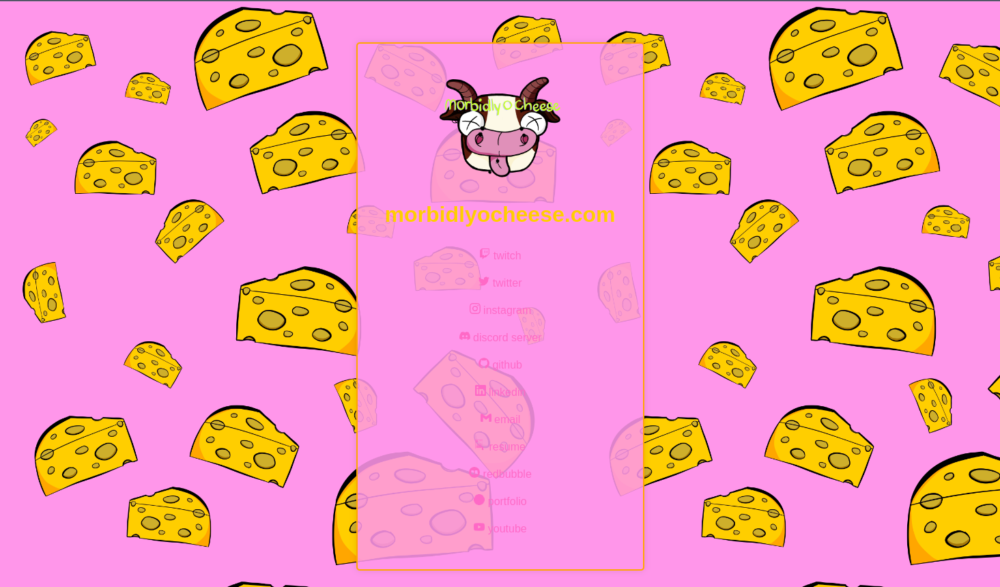

# morbidlyocheese.com
website for morbidlyocheese handle



[](https://app.netlify.com/sites/morbidlyocheese/deploys) [](https://wakatime.com/badge/github/morbidlyocheese/morbidlyocheese.com) [](https://app.codiga.io/hub/project/36248/morbidlyocheese.com)

---

### development/modifying page/s
within the `/src/components` is where the page's content is located. the `HomePage.vue` component is where you can change the page's content. the structure is the usual for [vue.js](https://vuejs.org/), use their documentation for more information.

---

### installation
> this assumes you have already cloned the repo to your local machine.
- run in terminal: `npm install`
    - installs dependencies
- run in terminal: `npm run serve`
    - hosts the website on local machine
- navigate to `http://localhost:8080/` to view the page

---

### wireframe [page design]

[figma wireframe](https://www.figma.com/file/8wSXTsPmD6kIK58wbe2xGa/morbidlyocheese.com-wireframe?t=fdBA3VkbNBu9I0V6-1)

---

### file/folder structure
```
.
├── babel.config.js
├── node_modules
├── dist
├── images
│   └── doc-images
│       ├── moc-website.png
│       └── whole page.png
├── jsconfig.json
├── package.json
├── package-lock.json
├── public
│   ├── android-chrome-192x192.png
│   ├── android-chrome-512x512.png
│   ├── apple-touch-icon.png
│   ├── favicon-16x16.png
│   ├── favicon-32x32.png
│   ├── favicon.ico
│   ├── index.html
│   └── site.webmanifest
├── README.md
├── src
│   ├── App.vue
│   ├── assets
│   │   ├── background.png
│   │   └── logo_cowbert.png
│   ├── components
│   │   ├── ComicNav.vue
│   │   └── HomePage.vue
│   └── main.js
└── vue.config.js

7 directories, 22 files
```

---

### todo
- [x] design wireframe of site
- [x] find color palette
- [x] figure out framework/library to use
    - to handle webcomic things
- [ ] create links for each platform
    - [x] instagram
    - [x] redbubble
    - [x] linkedin
    - [x] twitter
    - [x] discord
    - [x] portfolio
    - [x] resume
    - [ ] trello
    - [x] email
    - [x] github
    - [ ] tiktok
    - [x] twitch
    - [x] youtube

---

#### possible | look into
- displaying last tweet on home page -> mostly for notification of stream changes
- ways to display images and such for the webcomic -> lookinto frameworks/apis

---

### technologies/tools used
- Vue.js
- HTML
- CSS
- JavaScript
- Visual Studio Code
- tree
    - display the folder/file structure
- Netlify
    - site host

---

### shields

